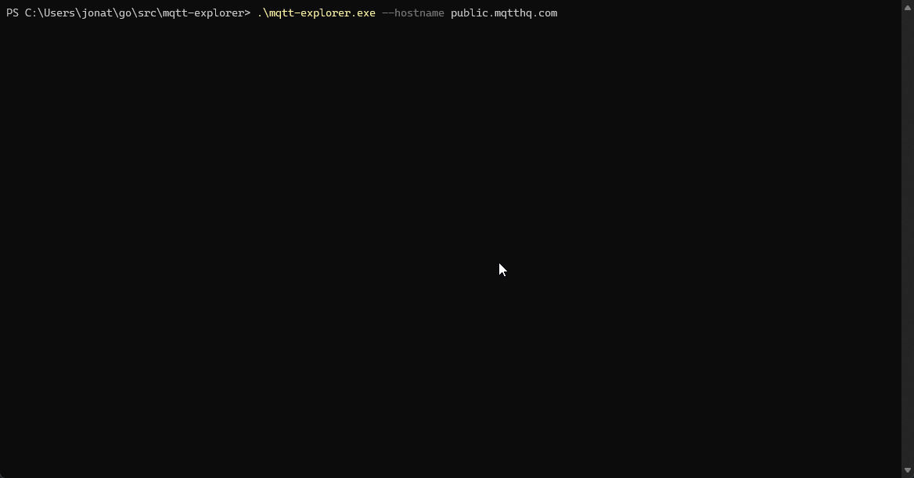

<p align="center">

</p>
<h3 align="center">MQTT Explorer - CLI based MQTT client displayed in an easy to navigate tree</h3>
<div align="center">

[](https://github.com/Snappey/MQTT-Explorer/actions/workflows/go.yml)
[](https://github.com/Snappey/MQTT-Explorer/actions/workflows/release.yml)

</div>
<h5 align="center"> The project is currently in early development, bugs and weirdness to be expected.</h5>
<br/>
<a href="https://immich.app">

</a>
<br/>


A CLI for exploring and interacting with MQTT topics, inspired by the original [MQTT-Explorer](https://mqtt-explorer.com), but brought directly into your command line. This tool enables you to navigate and view your MQTT broker's topic structure in a intuitive, tree-like format, and provides functionality to view the latest payload data and publish arbitrary messages to existing topics.

## Features

**Current:**
- Visualize your entire broker's topic structure in an interactive, navigatable tree.
- View the latest payload for any given topic.
- Publish arbitrary messages to existing topics.

**Planned:**
- View historical payloads for a given topic, with differences between each.
- Publish to arbitrary topics with customizable QoS and Retained message configurations.
- Implement search functionality and filtering capabilities for the topic structure.
- Syntax highlighting for payloads to improve readability.
- Profile support to automatically connect to saved brokers

## Installation

MQTT-Explorer can be installed using `go install` or downloading the latest binary from Releases.

```shell
go install github.com/snappey/mqtt-explorer@latest
```

## Usage

Ensure that the binary exists within your PATH, this is handled for you if `go install` is used.

```shell
mqtt-explorer [flags]

Flags:
  -h, --help              help for mqtt-explorer
      --hostname string   hostname of the broker (default "test.mosquitto.org")
      --port int          port the broker is running on, typically tcp: 1883, ssl: 8883, ws: 8083 or wss: 8084 (default 1883)
      --scheme string     protocol to use tcp, ssl, ws or wss (default "tcp")
      --topic string      topic to subscribe to on the broker (default "#")
```
### Keybinds
```shell
Q, Ctrl+C                     - Close the application
Arrow Keys                    - Move around the Tree
Shift Up/Down Arrow Keys      - Skip 5
Shift Ctrl Up/Down Arrow Keys - Skip 25
HOME                          - Skip to Start
END                           - Skip to End
TAB                           - Toggle focus to publish message textarea 
```